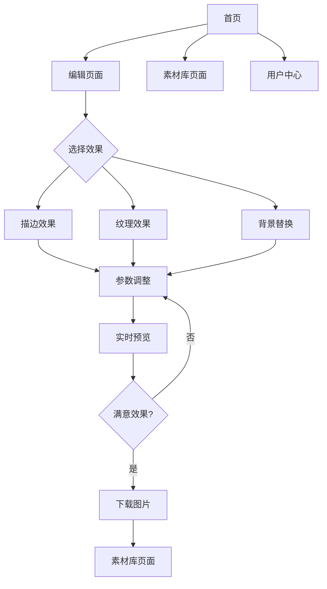

## 1. 产品概述
图片处理应用是一个专业的在线图像处理平台，用户可以通过上传图片并应用各种高级效果（描边、纹理、背景替换等）将普通图片转换为高质量的设计素材。

该应用主要服务于设计师、内容创作者和营销人员，帮助他们快速将普通图片处理成具有专业视觉效果的素材，提升工作效率和作品质量。

## 2. 核心功能

### 2.1 用户角色
| 角色 | 注册方式 | 核心权限 |
|------|----------|----------|
| 普通用户 | 邮箱注册 | 上传图片、应用基础效果、下载处理后的图片 |
| 高级用户 | 付费升级 | 使用所有高级效果、批量处理、高分辨率导出 |

### 2.2 功能模块
我们的图片处理应用包含以下主要页面：
1. **首页**：展示应用特色、效果预览、上传入口
2. **编辑页面**：图片上传、效果选择、参数调整、实时预览
3. **素材库页面**：用户历史处理记录、素材管理
4. **用户中心**：个人信息、订阅管理、使用统计

### 2.3 页面详情
| 页面名称 | 模块名称 | 功能描述 |
|-----------|-------------|-------------|
| 首页 | 英雄区域 | 展示应用主要功能和特色效果，包含轮播图展示处理前后对比 |
| 首页 | 功能介绍 | 介绍各种图片处理效果和适用场景 |
| 首页 | 上传入口 | 明显的上传按钮，支持拖拽上传和点击上传 |
| 编辑页面 | 图片上传区 | 支持多种格式图片上传（JPG、PNG、WEBP），显示上传进度 |
| 编辑页面 | 效果选择区 | 提供描边、纹理、背景替换等多种效果选项 |
| 编辑页面 | 参数调整面板 | 针对不同效果提供详细的参数调整滑块和选项 |
| 编辑页面 | 实时预览区 | 显示原图和处理后效果的对比，支持放大缩小 |
| 编辑页面 | 导出功能区 | 提供下载按钮，支持不同分辨率选择 |
| 素材库页面 | 历史记录 | 展示用户处理过的所有图片缩略图 |
| 素材库页面 | 搜索筛选 | 支持按效果类型、处理时间等条件筛选 |
| 素材库页面 | 批量操作 | 支持批量下载、删除等操作 |
| 用户中心 | 个人信息 | 显示用户基本信息和头像 |
| 用户中心 | 订阅状态 | 显示当前订阅计划和到期时间 |
| 用户中心 | 使用统计 | 显示图片处理次数、存储空间使用等 |

## 3. 核心流程
用户操作流程主要分为以下几个步骤：

**普通用户流程**：
1. 访问首页，了解应用功能
2. 点击上传按钮或直接拖拽图片到上传区域
3. 在编辑页面选择想要的效果（描边、纹理、背景替换等）
4. 调整效果参数，实时预览处理结果
5. 满意后点击下载按钮保存处理后的图片

**高级用户流程**：
1. 登录后可以使用所有高级效果
2. 支持批量上传多张图片进行处理
3. 可以选择更高的输出分辨率
4. 处理的图片自动保存到素材库
5. 可以随时从历史记录中重新编辑或下载

## 4. 用户界面设计

### 4.1 设计风格
- **主色调**：深蓝色（#1E3A8A）和白色为主，橙色（#F97316）作为强调色
- **按钮样式**：圆角矩形设计，主要按钮使用渐变色，悬停时有阴影效果
- **字体**：中文使用思源黑体，英文使用Inter，主要文字16px，标题24-32px
- **布局风格**：卡片式布局，大量留白，现代化简约风格
- **图标风格**：使用线性图标，简洁现代，统一使用2px线条粗细

### 4.2 页面设计概述
| 页面名称 | 模块名称 | UI元素 |
|-----------|-------------|-------------|
| 首页 | 英雄区域 | 全屏背景渐变，居中标题文字，下方轮播图展示效果对比，自动切换间隔3秒 |
| 编辑页面 | 图片上传区 | 虚线边框的拖拽区域，中央有大上传图标，支持拖拽时的视觉反馈 |
| 编辑页面 | 效果选择区 | 左侧边栏设计，图标+文字的形式，选中状态有颜色变化 |
| 编辑页面 | 预览区 | 左右分屏显示原图和效果图，支持同步缩放和拖拽查看 |
| 素材库页面 | 网格布局 | 响应式网格展示缩略图，悬停时显示操作按钮和详细信息 |

### 4.3 响应式设计
- 采用桌面端优先的设计方案，主要面向专业用户
- 平板端适配：调整布局为单栏或双栏，保持核心功能完整
- 手机端：提供基础的上传和处理功能，复杂的参数调整可简化
- 支持触摸操作优化，特别是图片预览区域的缩放和拖拽

### 4.4 3D场景指导
由于本应用主要处理2D图片，暂不需要3D场景设计。但在效果预览时可以考虑加入一些3D转换效果，如卡片翻转、立体阴影等，增强视觉体验。