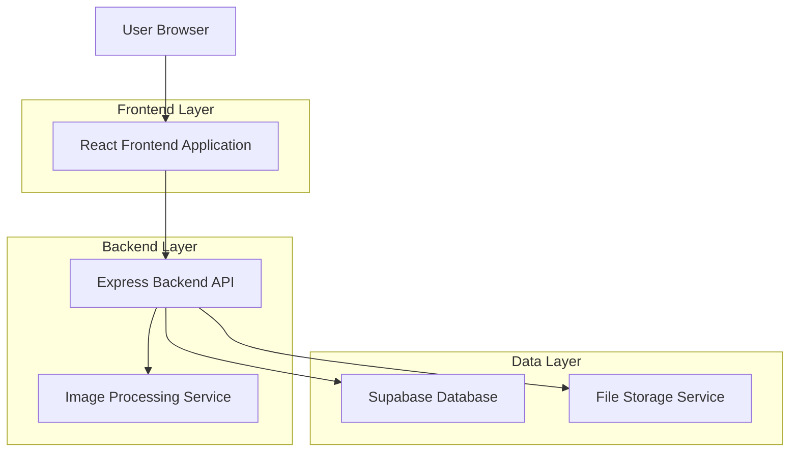
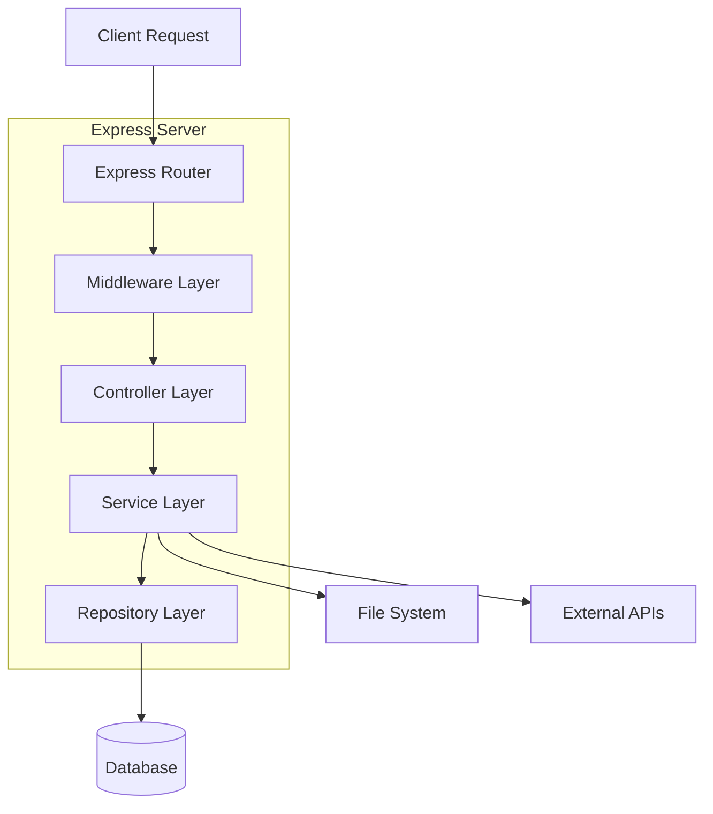
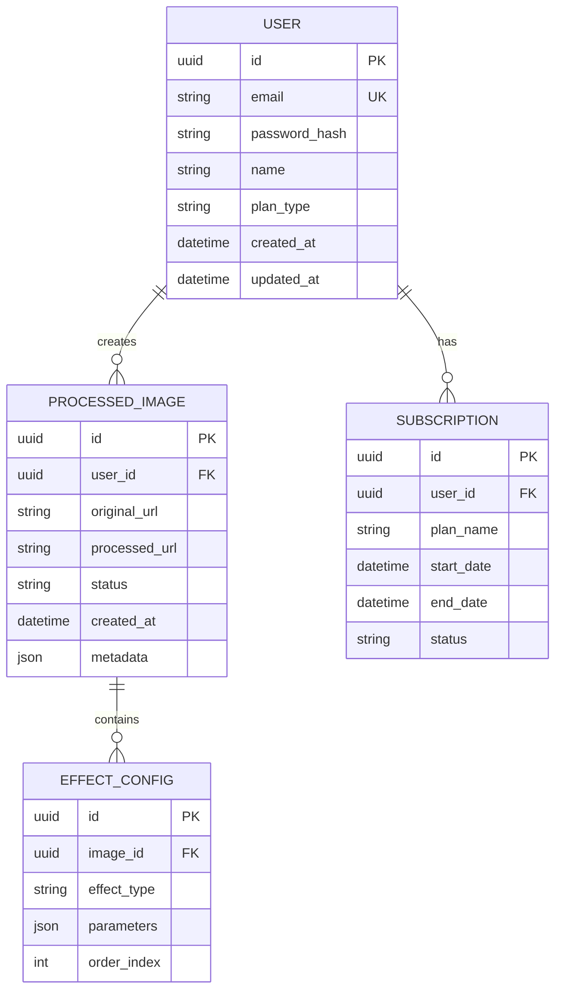

## 1. 架构设计



## 2. 技术描述
- **前端**: React@18 + TypeScript + TailwindCSS@3 + Vite
- **初始化工具**: vite-init
- **后端**: Express@4 + TypeScript + Multer（文件上传）
- **数据库**: Supabase (PostgreSQL)
- **文件存储**: Supabase Storage
- **图片处理**: Sharp（服务器端处理）+ Canvas API（客户端预览）

## 3. 路由定义

| 路由 | 用途 |
|-------|---------|
| / | 首页，展示应用特色和功能介绍 |
| /editor | 编辑页面，图片上传和效果处理 |
| /gallery | 素材库页面，用户历史记录管理 |
| /profile | 用户中心，个人信息和订阅管理 |
| /login | 登录页面，用户身份验证 |
| /register | 注册页面，新用户注册 |

## 4. API定义

### 4.1 图片处理API

**图片上传**
```
POST /api/upload
```

请求:
| 参数名 | 参数类型 | 是否必需 | 描述 |
|-----------|-------------|-------------|-------------|
| image | File | 是 | 图片文件 |
| userId | string | 是 | 用户ID |

响应:
| 参数名 | 参数类型 | 描述 |
|-----------|-------------|-------------|
| success | boolean | 上传状态 |
| fileUrl | string | 文件访问URL |
| fileId | string | 文件唯一标识 |

**应用图片效果**
```
POST /api/process
```

请求:
| 参数名 | 参数类型 | 是否必需 | 描述 |
|-----------|-------------|-------------|-------------|
| imageUrl | string | 是 | 原始图片URL |
| effects | array | 是 | 效果配置数组 |
| outputFormat | string | 否 | 输出格式（jpg, png, webp） |

响应:
| 参数名 | 参数类型 | 描述 |
|-----------|-------------|-------------|
| success | boolean | 处理状态 |
| processedUrl | string | 处理后图片URL |
| processingTime | number | 处理耗时（毫秒） |

### 4.2 用户管理API

**用户注册**
```
POST /api/auth/register
```

请求:
| 参数名 | 参数类型 | 是否必需 | 描述 |
|-----------|-------------|-------------|-------------|
| email | string | 是 | 邮箱地址 |
| password | string | 是 | 密码 |
| name | string | 是 | 用户名 |

**用户登录**
```
POST /api/auth/login
```

请求:
| 参数名 | 参数类型 | 是否必需 | 描述 |
|-----------|-------------|-------------|-------------|
| email | string | 是 | 邮箱地址 |
| password | string | 是 | 密码 |

## 5. 服务器架构图



## 6. 数据模型

### 6.1 数据模型定义



### 6.2 数据定义语言

**用户表 (users)**
```sql
-- 创建用户表
CREATE TABLE users (
    id UUID PRIMARY KEY DEFAULT gen_random_uuid(),
    email VARCHAR(255) UNIQUE NOT NULL,
    password_hash VARCHAR(255) NOT NULL,
    name VARCHAR(100) NOT NULL,
    plan_type VARCHAR(20) DEFAULT 'free' CHECK (plan_type IN ('free', 'premium', 'pro')),
    created_at TIMESTAMP WITH TIME ZONE DEFAULT NOW(),
    updated_at TIMESTAMP WITH TIME ZONE DEFAULT NOW()
);

-- 创建索引
CREATE INDEX idx_users_email ON users(email);
CREATE INDEX idx_users_plan ON users(plan_type);
```

**处理图片表 (processed_images)**
```sql
-- 创建处理图片表
CREATE TABLE processed_images (
    id UUID PRIMARY KEY DEFAULT gen_random_uuid(),
    user_id UUID REFERENCES users(id) ON DELETE CASCADE,
    original_url TEXT NOT NULL,
    processed_url TEXT,
    status VARCHAR(20) DEFAULT 'processing' CHECK (status IN ('processing', 'completed', 'failed')),
    metadata JSONB DEFAULT '{}',
    created_at TIMESTAMP WITH TIME ZONE DEFAULT NOW(),
    updated_at TIMESTAMP WITH TIME ZONE DEFAULT NOW()
);

-- 创建索引
CREATE INDEX idx_processed_images_user_id ON processed_images(user_id);
CREATE INDEX idx_processed_images_status ON processed_images(status);
CREATE INDEX idx_processed_images_created_at ON processed_images(created_at DESC);
```

**效果配置表 (effect_configs)**
```sql
-- 创建效果配置表
CREATE TABLE effect_configs (
    id UUID PRIMARY KEY DEFAULT gen_random_uuid(),
    image_id UUID REFERENCES processed_images(id) ON DELETE CASCADE,
    effect_type VARCHAR(50) NOT NULL,
    parameters JSONB NOT NULL DEFAULT '{}',
    order_index INTEGER DEFAULT 0,
    created_at TIMESTAMP WITH TIME ZONE DEFAULT NOW()
);

-- 创建索引
CREATE INDEX idx_effect_configs_image_id ON effect_configs(image_id);
CREATE INDEX idx_effect_configs_effect_type ON effect_configs(effect_type);
```

### 6.3 Supabase权限设置

```sql
-- 基本权限设置
-- 匿名用户只读权限
GRANT SELECT ON users TO anon;
GRANT SELECT ON processed_images TO anon;

-- 认证用户完全权限
GRANT ALL PRIVILEGES ON users TO authenticated;
GRANT ALL PRIVILEGES ON processed_images TO authenticated;
GRANT ALL PRIVILEGES ON effect_configs TO authenticated;

-- RLS (Row Level Security) 策略
ALTER TABLE processed_images ENABLE ROW LEVEL SECURITY;
ALTER TABLE effect_configs ENABLE ROW LEVEL SECURITY;

-- 用户只能查看和处理自己的图片
CREATE POLICY "Users can view own images" ON processed_images
    FOR SELECT USING (auth.uid() = user_id);

CREATE POLICY "Users can insert own images" ON processed_images
    FOR INSERT WITH CHECK (auth.uid() = user_id);

CREATE POLICY "Users can update own images" ON processed_images
    FOR UPDATE USING (auth.uid() = user_id);

CREATE POLICY "Users can delete own images" ON processed_images
    FOR DELETE USING (auth.uid() = user_id);
```